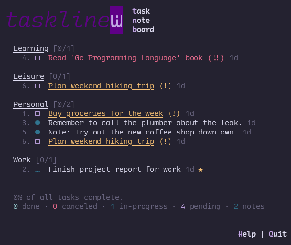

A TUI for [taskline](https://github.com/perryrh0dan/taskline), built in Go using [Bubble Tea](https://github.com/charmbracelet/bubbletea).



## Overview and Supported Features

**tasklineUI** is a simple UI wrapper for [taskline](https://github.com/perryrh0dan/taskline).

- Shows the output from `taskline` in a scrollable, auto-updating view, preserving its colors.
- Currently allows adding tasks and notes to boards.
- Supports mouse wheel scrolling (mouse support for acessing all actions is planned).

Unless there is demand, this will probably not support deleting, moving, or any direct interaction with already existing items. That would require a lot of parsing taskline output, or reimplementing a lot of its logic.


## Installation
You can either run the `tasklineUI.go` file directly or create a binary.

### Prerequisites

- [taskline](https://github.com/perryrh0dan/taskline) must be installed and available in your `$PATH`
- [Go](https://golang.org/) 1.18 or later

### Build a Binary 

```sh
git clone https://github.com/visrosa/tasklineUI.git
cd tasklineUI
go build -buildvcs=false
```

This will create a binary you can run with `./tasklineUI` from the project directory or move to your $PATH.

### Run directly

To run:

```sh
git clone https://github.com/visrosa/tasklineUI.git
cd tasklineUI
go run tasklineUI.go
```

## License

GPL v3.0 or later. See [LICENSE](LICENSE) for details.

## Acknowledgments

- [taskline](https://github.com/perryrh0dan/taskline) – the backend task/note manager
- [Bubble Tea](https://github.com/charmbracelet/bubbletea) & [Lip Gloss](https://github.com/charmbracelet/lipgloss) – UI framework and styling
- [Reflow](https://github.com/muesli/reflow) for ANSI-aware word-wrapping
  

